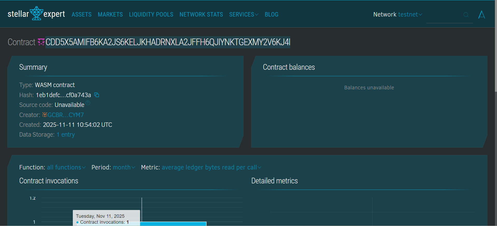

# Asset-Backed Token Platform

## Project Title
**Asset-Backed Token Platform**

## Project Description
Build a system for creating tokens backed by real-world assets like gold, real estate, or commodities. This smart contract enables users to tokenize physical assets on the Stellar blockchain using Soroban SDK, providing transparency, verification, and tracking of asset-backed digital tokens.

## Project Vision
Our vision is to bridge the gap between traditional physical assets and blockchain technology, making real-world asset ownership more accessible, transparent, and tradeable. By tokenizing assets like gold, real estate, and commodities, we aim to:

- **Democratize Asset Ownership**: Enable fractional ownership of high-value assets
- **Increase Liquidity**: Make traditionally illiquid assets easily tradeable
- **Enhance Transparency**: Provide immutable records of asset backing and verification
- **Build Trust**: Implement admin verification to ensure asset authenticity
- **Global Accessibility**: Allow anyone, anywhere to invest in real-world assets

## Key Features

### 1. **Token Creation**
- Users can create asset-backed tokens by specifying:
  - Asset type (Gold, Real Estate, Commodities, etc.)
  - Asset value in base units
  - Number of tokens to issue
- Automatic token ID generation
- Owner authentication required
- Timestamp recording for audit trails

### 2. **Admin Verification System**
- Admin-controlled verification process
- Ensures asset authenticity before tokens become fully tradeable
- Tracks verified vs unverified tokens
- Prevents double verification

### 3. **Token Information Retrieval**
- View detailed information about any token:
  - Token ID
  - Asset type and value
  - Number of tokens issued
  - Owner address
  - Verification status
  - Creation timestamp

### 4. **Platform Statistics**
- Real-time tracking of:
  - Total tokens created
  - Number of verified tokens
  - Total asset value locked in the platform
- Useful for investors and platform analytics

### 5. **Security Features**
- Owner authentication for token creation
- Admin authentication for verification
- TTL (Time To Live) extension for data persistence
- Panic handling for invalid operations

## Future Scope

### Short-term Enhancements
1. **Token Transfer Functionality**: Enable peer-to-peer transfers of asset-backed tokens
2. **Redemption System**: Allow token holders to redeem tokens for physical assets
3. **Price Oracle Integration**: Real-time asset valuation updates
4. **Multi-admin System**: Implement role-based access control for multiple verifiers

### Medium-term Development
5. **Fractional Ownership**: Support for partial token ownership and trading
6. **Audit Trail**: Comprehensive history of all token transactions
7. **Asset Categories**: Expanded support for different asset classes
8. **Yield Generation**: Mechanisms for tokens to generate returns based on asset performance
9. **Insurance Integration**: Protection for tokenized assets

### Long-term Vision
10. **Cross-chain Bridge**: Enable asset-backed tokens to move across different blockchains
11. **DeFi Integration**: Use tokens as collateral in lending protocols
12. **Governance System**: Token holder voting on platform decisions
13. **Marketplace**: Dedicated exchange for trading asset-backed tokens
14. **Regulatory Compliance**: KYC/AML integration for institutional adoption
15. **Mobile Application**: User-friendly interface for mobile users
16. **Asset Custody Solutions**: Partnership with regulated custodians
17. **Automated Market Making**: Liquidity pools for asset-backed tokens

---

## Smart Contract Functions

### `create_token(env, owner, asset_type, asset_value, tokens_issued) -> u64`
Creates a new asset-backed token with the specified parameters.

**Parameters:**
- `env`: Soroban environment
- `owner`: Address of the token creator
- `asset_type`: String describing the asset (e.g., "Gold", "Real Estate")
- `asset_value`: Value of the backing asset in base units
- `tokens_issued`: Number of tokens to create

**Returns:** Token ID (u64)

---

### `verify_token(env, token_id, admin)`
Verifies an asset-backed token (admin only).

**Parameters:**
- `env`: Soroban environment
- `token_id`: ID of the token to verify
- `admin`: Address of the admin performing verification

---

### `view_token(env, token_id) -> AssetToken`
Retrieves detailed information about a specific token.

**Parameters:**
- `env`: Soroban environment
- `token_id`: ID of the token to view

**Returns:** AssetToken struct with complete token details

---

### `get_platform_stats(env) -> PlatformStats`
Retrieves platform-wide statistics.

**Parameters:**
- `env`: Soroban environment

**Returns:** PlatformStats struct with total tokens, verified tokens, and total asset value

---

## Getting Started

### Prerequisites
- Rust and Cargo installed
- Soroban CLI tools
- Stellar testnet/mainnet account

### Installation
```bash
# Clone the repository
git clone <repository-url>

# Build the contract
cargo build --target wasm32-unknown-unknown --release

# Deploy to Stellar
soroban contract deploy \
  --wasm target/wasm32-unknown-unknown/release/asset_backed_token.wasm \
  --source <your-account> \
  --network testnet
```

### Usage Example
```bash
# Create a token
soroban contract invoke \
  --id <contract-id> \
  --source <owner-account> \
  --network testnet \
  -- create_token \
  --owner <owner-address> \
  --asset_type "Gold" \
  --asset_value 1000 \
  --tokens_issued 100

# Verify token (admin)
soroban contract invoke \
  --id <contract-id> \
  --source <admin-account> \
  --network testnet \
  -- verify_token \
  --token_id 1 \
  --admin <admin-address>
```

---

## Contributing
We welcome contributions! Please submit pull requests or open issues for any improvements or bug fixes.

## License
This project is licensed under the MIT License.

## Contact
For questions or support, please reach out to the development team.

## contract details
CDD5X5AMIFB6KA2JS6KELJKHADRNXLA2JFFH6QJIYNKTGEXMY2V6KJ4I
